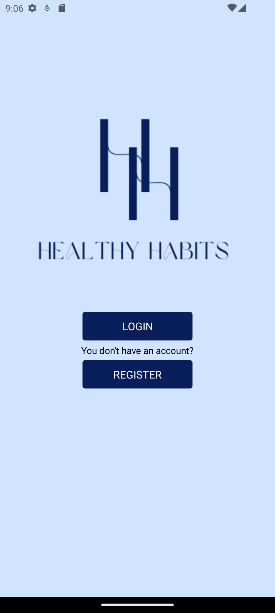
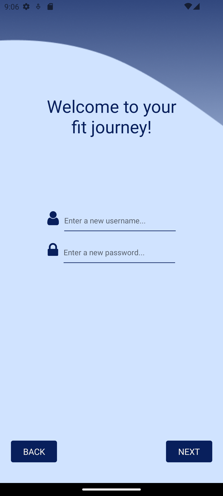
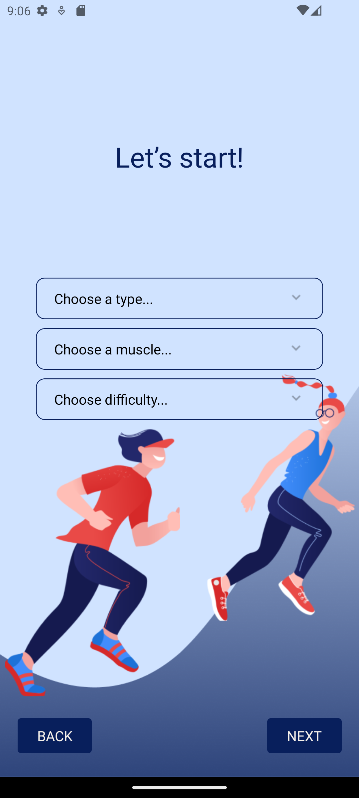
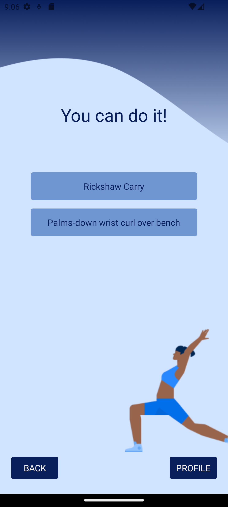
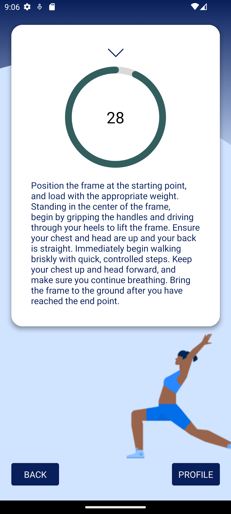

<h1> <b>HealthyHabits🏃‍♀️🍏</b></h1>

<b>HealthyHabits</b> is an application in which I wanted to motivate people to exercise more, through a set of
 exercises and prizes won. Using an api, the user can choose the type of exercises he wants to do that day,
 and after 7 days of training, he receives a healthy food recipe.  

The idea for this application came to me when I entered the "world of sports" and I didn't have the basic knowledge to handle myself, and an application like this would have helped me a lot.

 
<h2>App structure:</h2>
<h3>Landing and Authentication</h3>
<ul>
  <li><b>Landing Screen</b></li>
    
     
  <li><b>Login and Register Screens</b></li>
  
Here the user can log in or register to use the entire application.

   
   
</ul>

<h3>Choose Exercise Screen</h3>
<ul>
  
The user can filter his exercises according to the type of exercise, the muscles he wants to train and the difficulty of the exercise.

   
</ul>

<h3>See Exercise Screen</h3>
<ul>
  
After filtering the exercise, the application will take us to this screen, where you can see the names of the exercises that the user will perform. Also in this screen we can see how the exercise is performed, along with a timer that will tell us when the time is up.

   
   
</ul>
